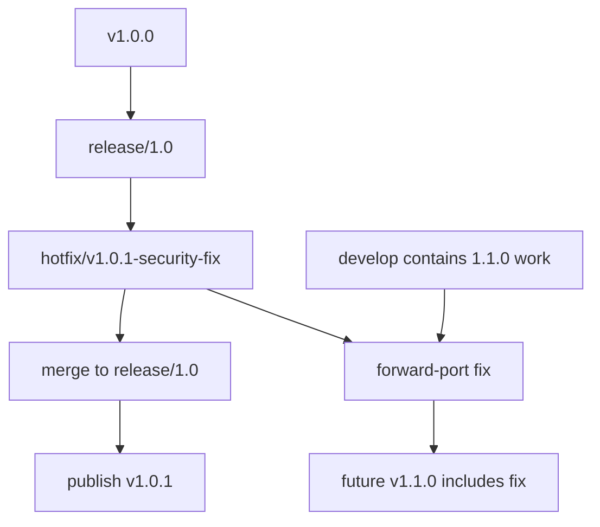

This guide explains how to ship an urgent production or security fix without accidentally including future feature work from `develop`.

Use it when a released stable version such as `v1.0.0` needs a patch release such as `v1.0.1`.

## Core rule

A hotfix belongs to two lines:

1. The supported stable line, for example `release/1.0`, so customers can get `v1.0.1` without `1.1.0` features.
2. `develop`, so the next planned release also contains the fix.

The stable patch is cut from `release/X.Y`, not from `develop`, once `develop` has moved ahead.

## Branch picture



## When to use this flow

Use a hotfix when:

- the fix must ship before the next planned minor or major release;
- the current production line is still supported;
- `develop` may contain changes that are not allowed in the patch release;
- the change can be kept narrow and tested.

Do not use a hotfix for normal feature work. Normal feature work targets `develop`.

## Version rule

The patch version must keep the same major/minor and increment PATCH by exactly one.

| Current stable | Valid patch | Invalid |
| --- | --- | --- |
| `v1.0.0` | `v1.0.1` | `v1.0.2`, `v1.1.0`, `v2.0.0` |
| `v1.4.2` | `v1.4.3` | `v1.4.4`, `v1.5.0` |
| `v2.0.0` | `v2.0.1` | `v2.0.2`, `v2.1.0` |

## Prerequisites

Before using this flow, confirm:

- `release/X.Y` exists for the supported stable line.
- CI runs on `release/**`.
- A candidate image workflow builds `sha-<short>` images for `release/**`.
- `.github/workflows/release-image.yml` accepts the matching maintenance branch for the patch tag.

If these automation prerequisites are not present yet, create them before publishing a maintenance-branch patch release.

## Step 1: Start from the stable line

Fetch tags and update the maintenance branch:

```bash
git fetch origin --tags
git checkout release/1.0
git pull origin release/1.0
```

If the maintenance branch does not exist yet, create it from the released tag:

```bash
git fetch origin --tags
git checkout -b release/1.0 v1.0.0
git push origin release/1.0
```

Create the hotfix branch:

```bash
git checkout -b hotfix/v1.0.1-security-fix release/1.0
```

Do not branch from `develop` for a `1.0.x` patch if `develop` already contains `1.1.0` work.

## Step 2: Implement the smallest safe fix

Keep the change narrow:

- fix only the production issue;
- add or update regression tests;
- avoid refactors unless required for the fix;
- avoid unrelated dependency bumps;
- document migration impact if a migration is unavoidable.

Run focused checks locally:

```bash
php artisan test --filter=<RelevantTest>
npm run test -- <RelevantComponentOrSpec>
```

If PHP files changed, run Pint:

```bash
./vendor/bin/pint
```

## Step 3: Open a PR into the maintenance branch

The PR target is the stable line:

```text
base: release/1.0
head: hotfix/v1.0.1-security-fix
```

The PR title should make the patch intent clear:

```text
[FIX] Patch authentication redirect for v1.0.1
```

Required review gates:

- CI green on the PR.
- Security review when the fix is security-sensitive.
- Codacy clean or explicitly accepted.
- Release notes drafted before merge.

## Step 4: Merge to `release/X.Y`

After review, merge the hotfix PR into the maintenance branch.

Record the merged hotfix commit:

```bash
git checkout release/1.0
git pull origin release/1.0
HOTFIX_SHA=$(git rev-parse HEAD)
SHORT_SHA=$(printf '%s' "$HOTFIX_SHA" | cut -c1-7)
echo "$HOTFIX_SHA"
```

Wait for CI and the candidate image workflow to complete.

Confirm the candidate image exists:

```bash
docker buildx imagetools inspect \
  ghcr.io/veviad/veviad_app:sha-$SHORT_SHA
```

## Step 5: Publish the patch release

Prepare release notes. Include:

- the production issue fixed;
- affected versions;
- security impact if discloseable;
- migration impact;
- rollback notes;
- the source commit.

Create and push the annotated tag:

```bash
RELEASE_TAG=v1.0.1
git tag -a "$RELEASE_TAG" "$HOTFIX_SHA" -m "Release $RELEASE_TAG"
git push origin "$RELEASE_TAG"
```

Publish the GitHub Release:

```bash
gh release create "$RELEASE_TAG" \
  --target "$HOTFIX_SHA" \
  --title "$RELEASE_TAG" \
  --notes-file RELEASE_NOTES.md \
  --verify-tag
```

The production release workflow should validate the tag, verify CI and `sha-<short>`, enforce the PATCH\+1 rule, publish stable Docker tags, attach SBOM/evidence, and update release notes with the digest.

## Step 6: Verify the release

Verify both tags point to the same production digest:

```bash
IMAGE=ghcr.io/veviad/veviad_app

DIGEST_V=$(docker buildx imagetools inspect "$IMAGE:v1.0.1" \
  --format '{{json .Manifest.Digest}}' | tr -d '"')
DIGEST_CORE=$(docker buildx imagetools inspect "$IMAGE:1.0.1" \
  --format '{{json .Manifest.Digest}}' | tr -d '"')

test "$DIGEST_V" = "$DIGEST_CORE"
echo "Patch release digest: $DIGEST_V"
```

Download and inspect release evidence:

```bash
gh release download v1.0.1 \
  --pattern release-image.json \
  --pattern sbom.spdx.json \
  --pattern sbom.cyclonedx.json
```

If attestation is available:

```bash
gh attestation verify \
  "oci://ghcr.io/veviad/veviad_app@$DIGEST_V" \
  --repo veviad/veviad_app
```

## Step 7: Forward-port to `develop`

The same fix must reach `develop`.

Preferred path for a single hotfix commit:

```bash
git checkout develop
git pull origin develop
git cherry-pick -x "$HOTFIX_SHA"
git push origin develop
```

If the maintenance branch merge commit is not the right commit to cherry-pick, cherry-pick the actual fix commit instead.

If conflicts occur:

1. Resolve conflicts on `develop`.
2. Preserve the same fixed behavior.
3. Keep or adapt the regression test.
4. Push a PR to `develop` if direct push is not allowed.

Do not skip this step. A patch that exists only on `release/X.Y` can reappear as a regression in the next planned release.

## Security hotfix notes

For sensitive security fixes:

- keep branch and PR visibility aligned with the disclosure policy;
- avoid detailed public notes until disclosure is approved;
- still record enough private evidence to audit the release;
- patch the oldest supported affected stable line first if customers are exposed;
- forward-port to every active future line that contains the vulnerability.

## What happens to feature branches?

Feature branches are still temporary branches that eventually merge into `develop`. They do not automatically receive every hotfix commit while they are open.

To keep a feature branch current:

```bash
git checkout feature/my-feature
git fetch origin
git merge origin/develop
```

or, if your branch is safe to rewrite:

```bash
git checkout feature/my-feature
git fetch origin
git rebase origin/develop
```

When the hotfix has been forward-ported to `develop`, any active feature branch gets it the next time it updates from `develop`.

## Failure conditions

| Failure | Action |
| --- | --- |
| Patch tag skips a version | Use the next PATCH only |
| Candidate image missing | Fix or run release-branch image workflow before publishing |
| CI failed on `release/X.Y` | Fix the patch branch; do not release |
| Fix only exists on `release/X.Y` | Forward-port it to `develop` immediately |
| Conflict during forward-port | Resolve on `develop`; keep test coverage |
| Release tag already exists with different digest | Stop; never move the tag |

## Checklist

- Confirmed affected stable line, for example `1.0`.
- Updated or created `release/1.0` from the correct stable tag.
- Created `hotfix/v1.0.1-...` from `release/1.0`.
- Implemented the smallest safe fix with regression tests.
- Opened and merged PR into `release/1.0`.
- Confirmed CI green on the maintenance branch.
- Confirmed `sha-<short>` candidate image exists.
- Published `v1.0.1` from the hotfix commit.
- Verified Docker tags, digest, SBOM, and evidence.
- Forward-ported the fix to `develop`.
- Confirmed `develop` CI is green after the forward-port.

## Related guides

- [Release Handbook](/release-management/release-handbook) - full maintainer release handbook.
- [Versioning](/release-management/versioning) - version numbering and dev-line rules.
- [Upgrade Guide](/release-management/upgrade-guide) - customer upgrade instructions.
- [Database Rollback](/release-management/database-migration-rollback) - database recovery.